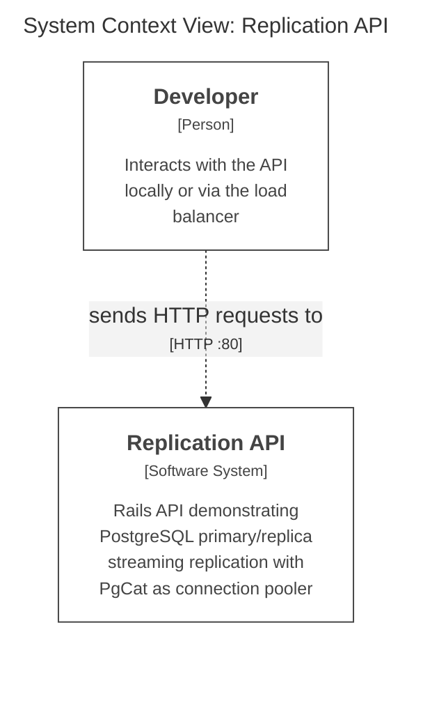
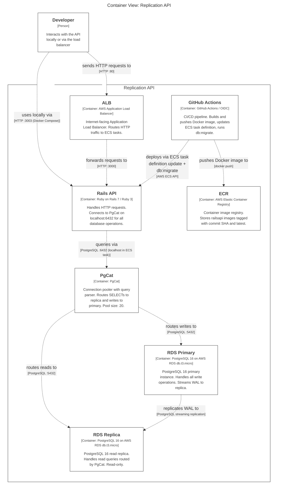
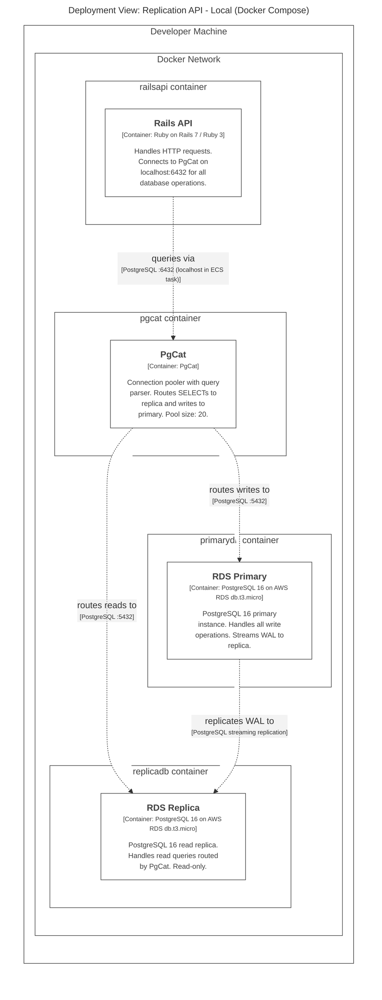
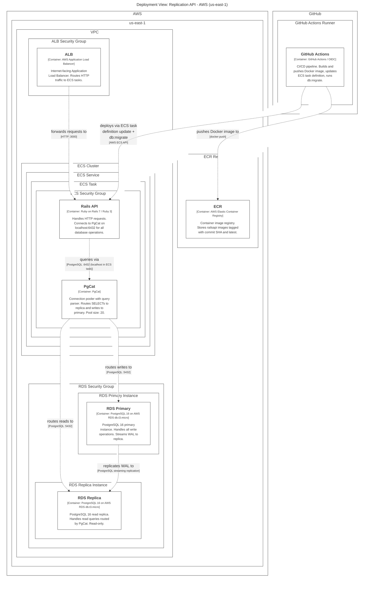

# Replication API

A Rails API demonstrating PostgreSQL primary/replica streaming replication with [PgCat](https://github.com/postgresml/pgcat) as an automatic read/write splitting connection pooler.

## Architecture

### System Context



### Containers



- **primarydb** — PostgreSQL primary with WAL-level logical replication and a physical replication slot (`replication_api_slot`)
- **replicadb** — PostgreSQL read-only replica cloned via `pg_basebackup`
- **pgcat** — Connection pooler with query parser enabled; routes `SELECT` to the replica and writes to the primary
- **railsapi** — Rails API pointing to PgCat via `DATABASE_URL`

---

## Setup

### 1. Copy the environment file

```bash
cp .env.sample .env
cp docker-compose.yml.sample docker-compose.yml
cp config/database.yml.sample config/database.yml
```

### 2. Start all services

```bash
docker compose up --build
```

On first boot the replica container will:

1. Wait for primarydb to be healthy
2. Confirm the replication slot exists
3. Run `pg_basebackup` to clone the primary
4. Start PostgreSQL in standby (read-only) mode

### 3. Create and migrate the database

Once all containers are running:

```bash
docker compose exec railsapi bin/rails db:create db:migrate
```

---

## Monitoring Replication

### Watch primary logs (writes + WAL activity)

```bash
docker compose logs -f primarydb
```

Look for lines like:

```
LOG:  starting logical decoding for slot "replication_api_slot"
LOG:  INSERT INTO "users" ...
```

### Watch replica logs (reads routed by PgCat)

```bash
docker compose logs -f replicadb
```

Look for lines like:

```
LOG:  started streaming WAL from primary at ...
LOG:  SELECT "users".* FROM "users" ...
```

### Confirm streaming replication is active (from primary)

```bash
docker compose exec primarydb psql -U postgres -c \
  "SELECT client_addr, state, sent_lsn, write_lsn, flush_lsn, replay_lsn \
   FROM pg_stat_replication;"
```

A row with `state = streaming` confirms the replica is in sync.

### Check the replication slot

```bash
docker compose exec primarydb psql -U postgres -c \
  "SELECT slot_name, active, restart_lsn FROM pg_replication_slots;"
```

`active = t` means the replica is connected and consuming WAL.

---

## Testing Read/Write Splitting

PgCat routes queries based on the SQL verb (`query_parser_read_write_splitting = true`). To observe the split:

### 1. Open a Rails console

```bash
docker compose exec railsapi bin/rails console
```

### 2. Trigger a write (routed to primary)

```ruby
User.create!(first_name: "Alice")
```

You will see the `INSERT` logged in `docker compose logs -f primarydb`.

### 3. Trigger a read (routed to replica)

```ruby
User.all.to_a
```

You will see the `SELECT` logged in `docker compose logs -f replicadb`.

### 4. Verify replication lag

```bash
docker compose exec primarydb psql -U postgres -c \
  "SELECT now() - pg_last_xact_replay_timestamp() AS replication_lag \
   FROM pg_stat_replication LIMIT 1;"
```

A near-zero lag confirms data written to the primary has been replicated.

---

## Local Deployment (Docker Compose)



---

## Ports

| Service   | Host port | Container port |
|-----------|-----------|----------------|
| primarydb | 54321     | 5432           |
| replicadb | 54322     | 5432           |
| pgcat     | 6432      | 6432           |
| railsapi  | 3003      | 3000           |

---

## Teardown

```bash
# Stop containers, keep volumes
docker compose down

# Stop and remove volumes (full reset)
docker compose down -v
```

---

## AWS ECS Architecture

The application can be deployed to AWS ECS using Terraform. The architecture uses the **sidecar pattern** — `railsapi` and `pgcat` run in the same ECS task and communicate over `localhost`. PgCat routes queries to the appropriate RDS instance automatically.



| Component | Role |
|-----------|------|
| **ALB** | Internet-facing load balancer; distributes traffic across ECS tasks |
| **ECS Service** | Maintains desired number of running tasks; auto-restarts on failure |
| **railsapi** | Your Rails app, connects to PgCat on `localhost:6432` |
| **pgcat** | Sidecar container; routes SELECTs to replica, writes to primary |
| **RDS Primary** | Managed PostgreSQL; handles all write operations |
| **RDS Replica** | Read replica; automatically replicates from primary via WAL streaming |

---

## Deploying to AWS ECS

### Prerequisites

- [Terraform](https://developer.hashicorp.com/terraform/install)
- [AWS CLI](https://docs.aws.amazon.com/cli/latest/userguide/getting-started-install.html)

### 1. Provision infrastructure with Terraform

```bash
cd terraform

# Create your variables file (NEVER commit this!)
cp terraform.tfvars.sample terraform.tfvars
# Edit terraform.tfvars and set your db_password

# Download providers
terraform init

# Preview what will be created
terraform plan

# Create everything (type "yes" to confirm)
terraform apply
```

Note the outputs after apply completes — you will need `github_actions_role_arn` and `ecr_repository_url`.

### 2. Configure GitHub Actions

1. Create a `production` branch in your repository
2. Go to **Settings > Secrets and variables > Actions > Variables**
3. Add a variable `AWS_ROLE_ARN` with the value from the Terraform output `github_actions_role_arn`
4. Every merged PR to `production` will now trigger an automatic deployment, including `db:create` and `db:migrate` before the service is updated

### 3. Tear down infrastructure

```bash
cd terraform

# Preview what will be destroyed
terraform plan -destroy

# Destroy everything (type "yes" to confirm)
terraform destroy
```

### Cost estimate

| Resource | Monthly Cost |
|---|---|
| RDS db.t3.micro x2 | ~$0 (free tier 12 months, ~$30 after) |
| ECS Fargate (0.25 vCPU, 0.5 GB) x2 | ~$15 |
| ALB | ~$16 + data transfer |
| ECR | ~$0 (first 500 MB free) |
| CloudWatch Logs | ~$0 (minimal) |
| **Total** | **~$31–61/month** |

To minimize costs while learning, set `desired_count = 1` in your Terraform variables and run `terraform destroy` when not using it.
